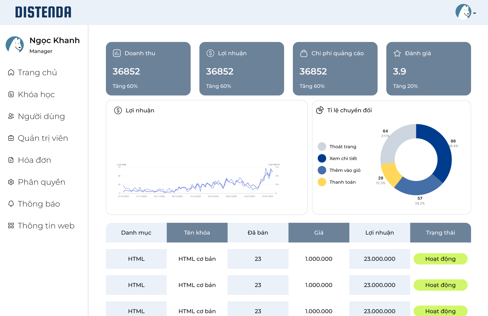
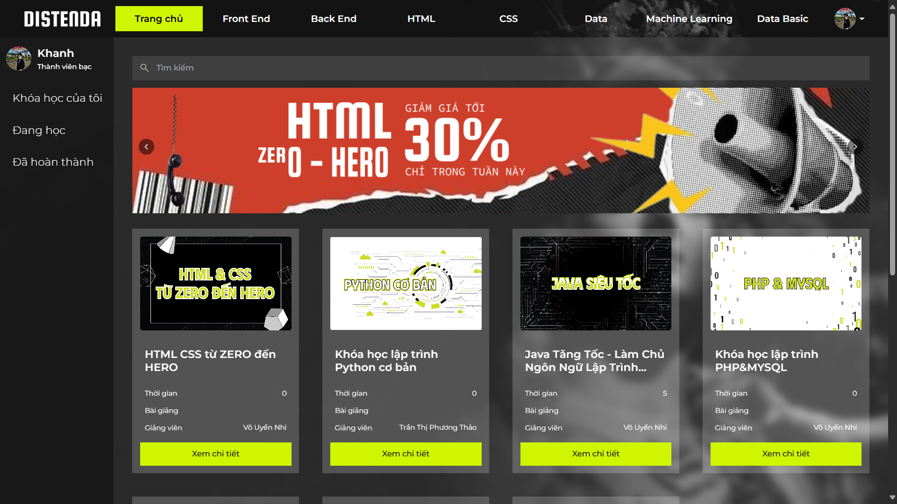

<!-- Improved compatibility of back to top link: See: https://github.com/pthao207203/IE104 -->
<a id="readme-top"></a>

<!-- PROJECT SHIELDS -->
[![Contributors][contributors-shield]][contributors-url]
[![Forks][forks-shield]][forks-url]
[![Stargazers][stars-shield]][stars-url]
[![Issues][issues-shield]][issues-url]
[![License][license-shield]][license-url]

<!-- PROJECT LOGO -->
<br />
<div align="center">
 <a href="https://github.com/pthao207203/IE104">
    
  </a>
</div>


  <h3 align="center">DISTENDA - Website Online Course Transactions and Management</h3>

  <p align="center">
    An exciting project for academic purposes in IE104 course.
    <br />
    <a href="https://github.com/pthao207203/IE104"><strong>Explore the docs »</strong></a>
    <br />
    <br />
    <a href="https://github.com/pthao207203/IE104">View Demo</a>
    &middot;
    <a href="https://github.com/pthao207203/IE104/issues">Report Bug</a>
    &middot;
    <a href="https://github.com/pthao207203/IE104/issues">Request Feature</a>
  </p>
</div>

<!-- TABLE OF CONTENTS -->
<details>
  <summary>Table of Contents</summary>
  <ol>
    <li>
      <a href="#about-the-project">About The Project</a>
      <ul>
        <li><a href="#built-with">Built With</a></li>
      </ul>
    </li>
    <li>
      <a href="#getting-started">Getting Started</a>
      <ul>
        <li><a href="#prerequisites">Prerequisites</a></li>
        <li><a href="#installation">Installation</a></li>
      </ul>
    </li>
    <li><a href="#usage">Usage</a></li>
    <li><a href="#roadmap">Roadmap</a></li>
    <li><a href="#authors">Authors</a></li>
    <li><a href="#license">License</a></li>
    <li><a href="#acknowledgments">Acknowledgments</a></li>
  </ol>
</details>

<!-- ABOUT THE PROJECT -->
## About The Project
<div align="center">
  
  <p align="center"><i>Admin website screen</i></p>
  
  <p align="center"><i>User website screen</i></p>
</div>

This project is an academic effort aimed at exploring software development methodologies and fostering teamwork. The repository contains structured source code and resources to build a functional web application that meets educational objectives.

### Key Features:
* Implements modern development practices
* Focused on clean code and documentation
* Interactive user interface

<p align="right">(<a href="#readme-top">back to top</a>)</p>

### Built With

This section highlights the frameworks and libraries used in the project.

* [![React][React.js]][React-url]
* [![Node.js][Node.js]][Node-url]
* [![Bootstrap][Bootstrap.com]][Bootstrap-url]

<p align="right">(<a href="#readme-top">back to top</a>)</p>

<!-- GETTING STARTED -->
## Getting Started

To get a local copy up and running, follow these steps.

### Prerequisites

Make sure you have the following installed:
* npm
  ```sh
  npm install npm@latest -g
  ```

### Installation

1. Clone the repository
   ```sh
   git clone https://github.com/pthao207203/IE104.git
   ```
2. Navigate to the project directory
   ```sh
   cd IE104
   ```
3. Install dependencies
   ```sh
   npm install
   ```

<p align="right">(<a href="#readme-top">back to top</a>)</p>

<!-- USAGE EXAMPLES -->
## Usage

This project can be used as a reference for academic or personal projects. Below are some use-case scenarios:
* Demonstrating web development practices.
* Exploring teamwork methodologies.

_For more details, please refer to the [Documentation](https://github.com/pthao207203/IE104)_

<p align="right">(<a href="#readme-top">back to top</a>)</p>

<!-- ROADMAP -->
## Roadmap

- [ ] Add more features
- [ ] Enhance UI design
- [ ] Improve testing coverage

See the [open issues](https://github.com/pthao207203/IE104/issues) for a list of proposed features and known issues.

<p align="right">(<a href="#readme-top">back to top</a>)</p>

<!-- CONTRIBUTING -->
## Authors

<div align="center">
  <a href="https://github.com/pthao207203">
    
  </a>
  <a href="https://github.com/vydo4243">
    
  </a>
  <a href="https://github.com/silren93">
    
  </a>
  <a href="https://github.com/vouyennhi">
    
  </a>
  <a href="https://github.com/huahongkhanh">
    
  </a>
  <a href="https://github.com/TrNhun128">
    
  </a>
</div>

<p align="right">(<a href="#readme-top">back to top</a>)</p>

<!-- LICENSE -->
## License

Distributed under the MIT License. See `LICENSE.txt` for more information.

<p align="right">(<a href="#readme-top">back to top</a>)</p>

<!-- ACKNOWLEDGMENTS -->
## Acknowledgments

Thanks to all contributors and resources that inspired this project:

* [React.js](https://reactjs.org/)
* [Node.js](https://nodejs.org/)
* [Bootstrap](https://getbootstrap.com/)

<p align="right">(<a href="#readme-top">back to top</a>)</p>

<!-- MARKDOWN LINKS & IMAGES -->
[contributors-shield]: https://img.shields.io/github/contributors/pthao207203/IE104.svg?style=for-the-badge
[contributors-url]: https://github.com/pthao207203/IE104/graphs/contributors
[forks-shield]: https://img.shields.io/github/forks/pthao207203/IE104.svg?style=for-the-badge
[forks-url]: https://github.com/pthao207203/IE104/network/members
[stars-shield]: https://img.shields.io/github/stars/pthao207203/IE104.svg?style=for-the-badge
[stars-url]: https://github.com/pthao207203/IE104/stargazers
[issues-shield]: https://img.shields.io/github/issues/pthao207203/IE104.svg?style=for-the-badge
[issues-url]: https://github.com/pthao207203/IE104/issues
[license-shield]: https://img.shields.io/github/license/pthao207203/IE104.svg?style=for-the-badge
[license-url]: https://github.com/pthao207203/IE104/blob/master/LICENSE.txt
[React.js]: https://img.shields.io/badge/React-20232A?style=for-the-badge&logo=react&logoColor=61DAFB
[React-url]: https://reactjs.org/
[Node.js]: https://img.shields.io/badge/Node.js-43853D?style=for-the-badge&logo=node.js&logoColor=white
[Node-url]: https://nodejs.org/
[Bootstrap.com]: https://img.shields.io/badge/Bootstrap-563D7C?style=for-the-badge&logo=bootstrap&logoColor=white
[Bootstrap-url]: https://getbootstrap.com
